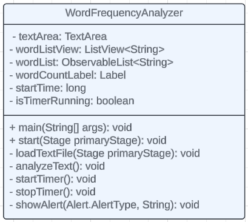

# CMIS202 Word Frequency Analyzer

A simple word frequency counter using TimSort.

• **Who are the users of the software?**
The users of the software could be students, educators, researchers, or anyone who deals with large amounts of text and needs to analyze word frequency for various purposes.

• **What is the purpose of the software?**
The purpose of the software is to analyze the frequency of words in text files. It helps users understand which words are used most frequently, providing insights into the overall content, language patterns, and potentially identifying key themes or topics.

• **Where and when will the software be used?**
The software could be used in various settings such as educational institutions, research organizations, publishing houses, content creation companies, or by individuals working on writing projects.

• **How does the software work?**
The software works by reading text files provided by the user, parsing the text to extract individual words, and then counting the frequency of each word using the TimSort algorithm. TimSort is a hybrid sorting algorithm derived from merge sort and insertion sort, optimized for sorting arrays with partially ordered elements, like the word frequencies in this case. The software may also include future features for preprocessing text, such as removing punctuation or stop words, to ensure accurate analysis.

• **Why would anyone want to use the software over existing processes?**
The software is open source and free to use, which makes it more customizable and accessable to students. The software uses algorithms to accurately count word frequencies, reducing the risk of human error.

I intend to add more future features such as total word count and pdf processing (and also make the GUI less ugly lol).

## Current UML Design

